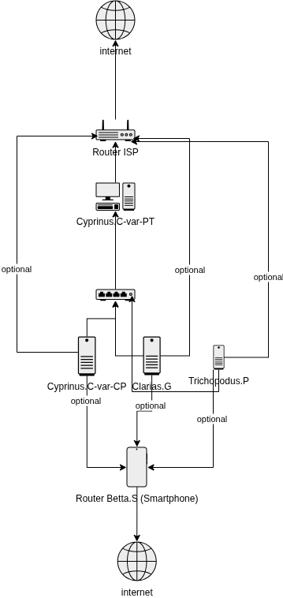

# Gawir Lake 01 - Penambahan Switch pada Versi Sebelumnya

- status: aktif
- versi: 01

## Member

- Router ISP
- Router Betta.S
- Clarias.G
- Cyprinus.C-var-CP
- Cyprinus.C-var-PT
- Trichopodus.P

## Detail

Homelab ini sudah menggunakan switch untuk menghubungkan semua komputer membernya.

Konsekuensinya, setiap komputer yang terhubung dengan switch bisa berkomunikasi langsung satu sama lain.

Komputer-komputer tersebut bisa terhubung langsung ke Router ISP maupun Router Betta.S secara optional.

## Diagram

